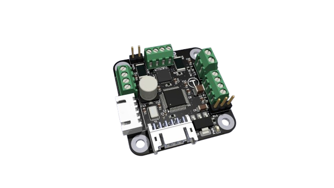

# Tercio S1 Stepper Driver

  
  

**Tercio S1** is a compact, high-performance closed-loop stepper driver with 14-bit encoder feedback and FDCAN communication. Designed for robotics, CNC, and automation applications requiring precision control at an accessible price point.

## Key features
- **Real-time closed-loop control** with auto-tune PID
- **14-bit magnetic encoder** (16,384 CPR) built-in
- **CANFD 2.5 Mbps** communication via FDCAN adapter
- **Motor support:** NEMA 17 and NEMA 23 steppers
- **Power:** 28 V max input, 3.5 A peak current (2 A per coil max)
- **170 MHz MCU** for high-speed processing
- **External SPI/I2C encoder support** for additional feedback
- **Web UI configuration** at [control.terciolabs.com](https://control.terciolabs.com)
- **Python and C++ libraries** included

## Quick start
1. Connect power (12–28 V) and your NEMA 17/23 stepper motor
2. Plug in the **Tercio FDcan USB adapter** (required for configuration and communication)
3. Open the Web UI at [control.terciolabs.com](https://control.terciolabs.com) and configure motor parameters
4. Run the example code (Python/C++) to test closed-loop motion

Full getting started guide: [docs.terciolabs.com](https://docs.terciolabs.com)

## Documentation & support
- **Docs:** [docs.terciolabs.com](https://docs.terciolabs.com)
- **Firmware:** Open-source repository (see below)
- **Libraries:** Python and C++ examples available

## Availability
**Kickstarter Q2 2026** — sign up for early bird access at [terciolabs.com](https://terciolabs.com)

## License
Firmware released under **GPL-3.0** (GNU General Public License v3.0).  
Hardware is proprietary. See `LICENSE` for full terms.
