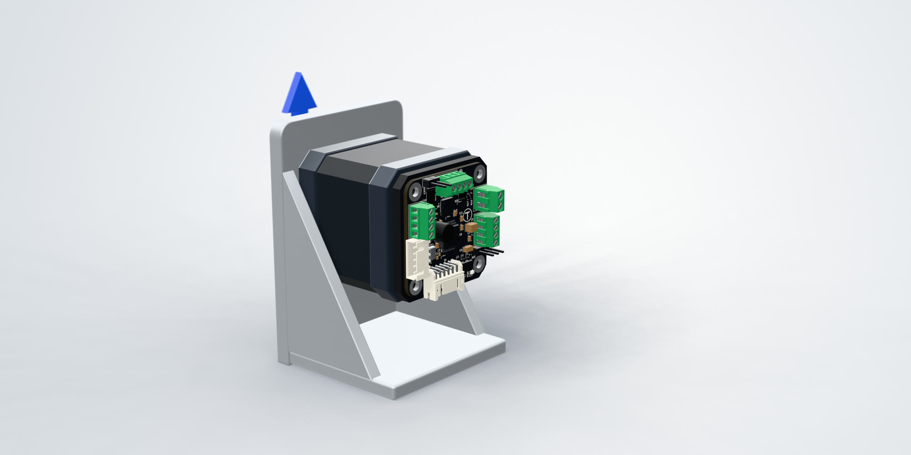
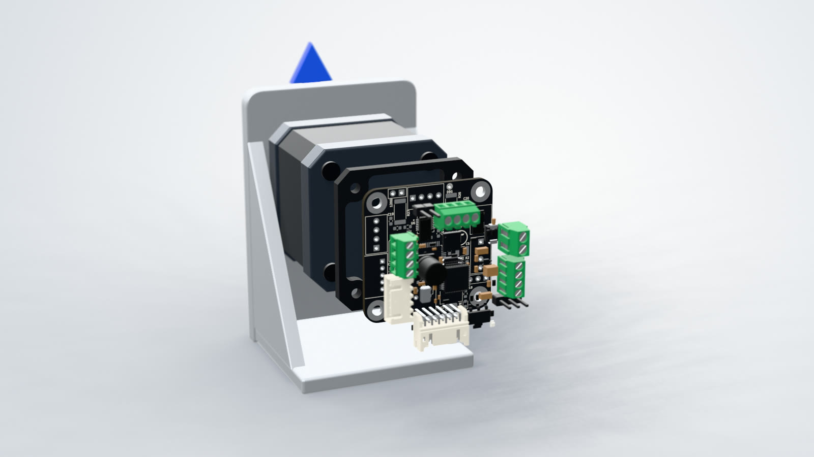
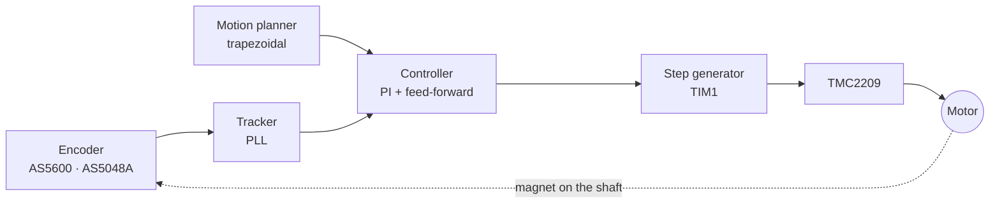
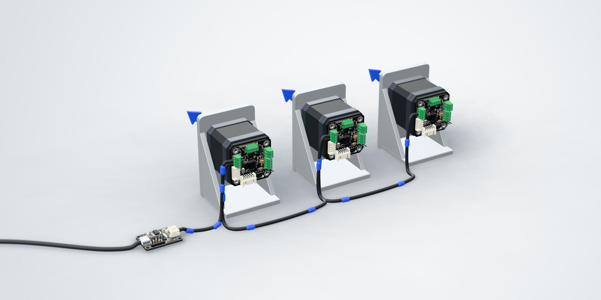
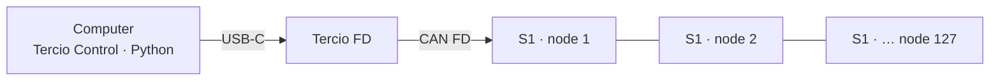
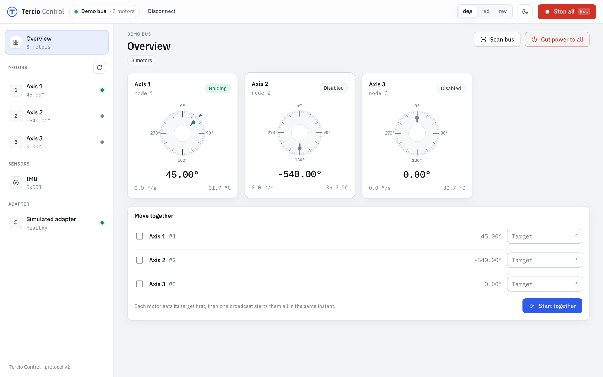

<div align="center">



# Tercio S1

**Closed-loop control that bolts onto the back of a NEMA 17.**

A magnetic encoder, a 20 kHz position loop and CAN FD on one 38 × 38 mm board.<br>
Drive it from your browser, from Python, from Arduino, or from the step/dir controller you already have.

[Website](https://terciolabs.kerol-kerem.workers.dev) ·
[Documentation](https://tercio-docs.kerol-kerem.workers.dev) ·
[Tercio Control](https://tercio-control.pages.dev) ·
[Libraries](#software)


**Launching December 1, 2026** · [Join the waitlist →](https://terciolabs.kerol-kerem.workers.dev)

</div>

---

## Why

Stepper motors are simple and precise, but they are blind. Push one too hard and it skips steps, and neither the driver nor you will ever know.

Tercio S1 fixes that without changing your motor. It mounts on the motor's rear, reads the shaft through a magnet on the shaft end, and corrects the position 20,000 times a second. If something blocks the axis, the S1 stops and reports a stall instead of carrying on out of position.

## Highlights

| | |
|---|---|
| **Never loses a step** | A 20 kHz position loop tracks the shaft through the on-board AS5600. A blocked axis is caught as a stall and stopped, never silently shifted. |
| **Tunes itself** | Auto-tune runs the axis faster and faster until it slips, then keeps the fastest speed and acceleration that passed three times. |
| **Quiet by default** | The TMC2209 runs StealthChop at low speed and switches to SpreadCycle when the motor needs the torque. |
| **Homes without switches** | Home against a limit switch, or gently into a hard stop at reduced current. |
| **Drop-in step/dir** | Configure it once over CAN, then drive it from any 3.3 V step/dir controller while it keeps the loop closed. |
| **One bus, many axes** | CAN FD at 2.5 Mbit/s connects up to 127 drivers to one Tercio FD adapter. |

## How it works



Everything that moves the shaft runs in one timer interrupt at 20 kHz, so the loop's timing never depends on what the main loop is doing.


```mermaid
flowchart LR
    ENC["Encoder<br/>AS5600 · AS5048A"] --> TRK["Tracker<br/>PLL"]
    PLAN["Motion planner<br/>trapezoidal"] --> CTRL
    TRK --> CTRL["Controller<br/>PI + feed-forward"]
    CTRL --> STEP["Step generator<br/>TIM1"]
    STEP --> DRV["TMC2209"]
    DRV --> MOT(("Motor"))
    MOT -. magnet on the shaft .-> ENC
```

- **Fixed-point motion core.** Positions are Q32.32 integers, and there is no floating point inside the interrupt.
- **Axis supervisor at 1 kHz.** It runs the state machine, faults and procedures: encoder calibration, homing and auto-tune.
- **Main loop.** It handles the CAN FD node, TMC2209 configuration over UART, and wear-levelled settings in flash.
- **Protection.** Stall detection, over-temperature shutdown and a command timeout.

## Specifications

| | |
|---|---|
| **Processor** | STM32G431, Arm Cortex-M4F at 170 MHz |
| **Position loop** | 20 kHz, trapezoidal motion planner |
| **Motor driver** | Trinamic TMC2209, up to 1/256 microstepping, StealthChop and SpreadCycle |
| **Current** | Up to 1.77 A RMS per coil (2.5 A peak), set in software |
| **Motor** | Bipolar stepper, NEMA 17 mounting |
| **On-board encoder** | AS5600, 12-bit (4,096 counts per turn), on the underside |
| **External encoder** | AS5048A (SPI, 14-bit) or AS5600 (I²C), 12-pin connector |
| **Bus** | CAN FD, 500 kbit/s arbitration and 2.5 Mbit/s data |
| **Nodes** | Up to 127 per bus, 120 Ω termination by jumper |
| **Step/dir** | STEP, DIR and EN inputs, 3.3 V logic only |
| **Inputs** | Two limit or home switch inputs |
| **Supply** | 12–28 V DC |
| **Board** | 38 × 38 mm |
| **Connectors** | Screw terminals: 3.5 mm for power; 2.54 mm for motor, CAN and switches. JST PH for step/dir; JST PHD 12-pin for the external encoder |

## The system: S1 + Tercio FD



**Tercio FD** is the USB-C to CAN FD adapter that connects your computer to the bus. It needs no drivers: it shows up as a standard USB serial device on Windows, macOS and Linux, and in Chrome or Edge through Web Serial. Every frame over USB carries a CRC, so a glitch is dropped and counted rather than misread.


```mermaid
flowchart LR
    HOST["Computer<br/>Tercio Control · Python"] -- "USB-C" --> FD["Tercio FD"]
    FD -- "CAN FD" --> N1["S1 · node 1"]
    N1 --- N2["S1 · node 2"]
    N2 --- N3["S1 · … node 127"]
```

| Tercio FD | |
|---|---|
| **Host** | USB-C, USB 2.0 full speed, serial (CDC) |
| **Bus** | CAN FD, 500 kbit/s arbitration and 2.5 Mbit/s data |
| **Transceiver** | Microchip MCP2562FD, 120 Ω termination on board |
| **Bus connector** | JST XH, 3-pin (CAN-H, CAN-L, GND) |

## Quick start

1. **Mount.** Fit the diametric magnet to the motor's rear shaft and bolt the S1 on top, encoder over the magnet.
2. **Wire.** Motor to the motor terminal, 12–28 V to the power terminal, and CAN to the Tercio FD.
3. **Connect.** Plug the FD into USB-C and open [Tercio Control](https://tercio-control.pages.dev) in Chrome or Edge. No hardware yet? Press *Try the demo*.
4. **Calibrate and move.** Run the encoder calibration once, then jog, home or auto-tune the axis from the panel.
5. **Script it.** Use the Python or Arduino library below.

The full guide, pinouts and the protocol reference are in the [documentation](https://tercio-docs.kerol-kerem.workers.dev).

## Software

### Tercio Control



A browser app for setup, tuning and live monitoring. It uses Web Serial, so there is nothing to install. It finds every motor on the bus and lets you:
- calibrate, home and auto-tune each axis;
- start moves on several axes at the same instant;
- watch bus health on the adapter.

The source is in [`Firmware/Web_Server`](Firmware/Web_Server): plain ES modules with no build step.

### Python

[`Firmware/Libraries/Python/TercioBridge.py`](Firmware/Libraries/Python/TercioBridge.py) is a single file that depends only on `pyserial`.

```python
from TercioBridge import Bus, Stepper, Unit

with Bus() as bus:                       # first serial port, or Bus("COM5")
    for info in bus.discover():
        print(info)
    motor = Stepper(bus, 1, unit=Unit.DEGREES)
    motor.enable()
    motor.move_to(90, wait=True)
    print(motor.position, motor.telemetry.state)
```

It also covers:
- `calibrate()`, `home()` and `auto_tune(minimum, maximum)`;
- `set_current()`, `set_microsteps()`, `set_limits()` and `set_pid()`;
- deferred moves started together with `bus.sync()`;
- adapter status and bus-wide stop / emergency stop.

### Arduino C++

[`Firmware/Libraries/Arduino/Cpp`](Firmware/Libraries/Arduino/Cpp) is the same protocol for Arduino-class boards. It talks to the FD over any `Stream` and uses no dynamic allocation.

```cpp
#include "TercioBridge.h"

Tercio::Bus bus(Serial1);
Tercio::Stepper motor(bus, 1, Tercio::Unit::Degrees);

void setup() {
  motor.enable();
  motor.moveTo(90.0);
}

void loop() {
  bus.poll();   // call on every loop iteration
}
```

## Firmware

The firmware is a PlatformIO project in [`Firmware`](Firmware). It builds against the STM32duino core and ST's HAL only, with no third-party libraries. The platform and core are pinned, so a fresh checkout builds exactly what was tested.

```bash
cd Firmware
pio run                  # build
pio run -t upload        # flash over ST-Link
pio test -e native       # host unit tests: planner, controller, encoder tracking, parameters, protocol
```

The CAN wire contract is [`Firmware/src/protocol/Protocol.h`](Firmware/src/protocol/Protocol.h), protocol v2. Each node uses a function code plus its node ID (1–127):

| Function | CAN ID |
|---|---|
| Broadcast | `0x000` |
| Event | `0x080` + node |
| Command | `0x100` + node |
| Reply | `0x180` + node |
| Telemetry | `0x200` + node |

## Repository layout

```text
Firmware/
├── src/
│   ├── app/          axis state machine, parameters, procedures, CAN node
│   ├── control/      motion planner, position controller, encoder tracker
│   ├── drivers/      CAN FD, TMC2209, step generator, timers, flash store
│   ├── encoder/      AS5600 and AS5048A
│   ├── protocol/     CAN protocol v2 definitions
│   └── board/        clocks, pins, version
├── test/             host unit tests (pio test -e native)
├── Libraries/
│   ├── Python/       TercioBridge.py
│   └── Arduino/Cpp/  TercioBridge.h / .cpp
├── Web_Server/       Tercio Control, the browser app
└── platformio.ini
Hardware/CAD/         Tercio-S1.step, the mechanical model
Github_Files/Images/  images used in this README
```

## Availability

Tercio S1 and Tercio FD launch on **December 1, 2026**. [Join the waitlist](https://terciolabs.kerol-kerem.workers.dev) to hear first.

## License

- The repository is licensed under the GNU General Public License v3.0; see [`LICENSE`](LICENSE).
- The firmware directory also carries its own license file, [`Firmware/LICENSE`](Firmware/LICENSE) (PolyForm Noncommercial 1.0.0).
- The S1 hardware design is not published. The STEP model in `Hardware/CAD` is provided for mechanical integration.

<div align="center">
<br>
<sub>Made by <a href="https://terciolabs.kerol-kerem.workers.dev">Tercio Labs</a></sub>
</div>
